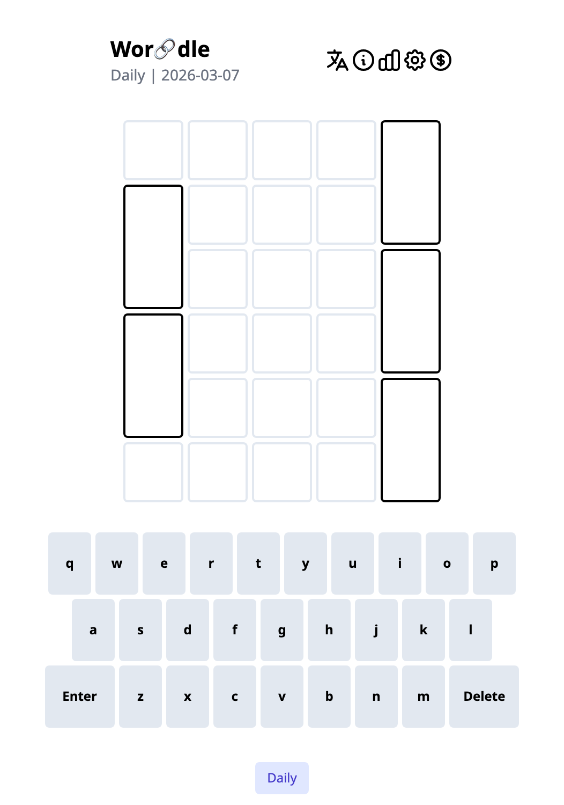
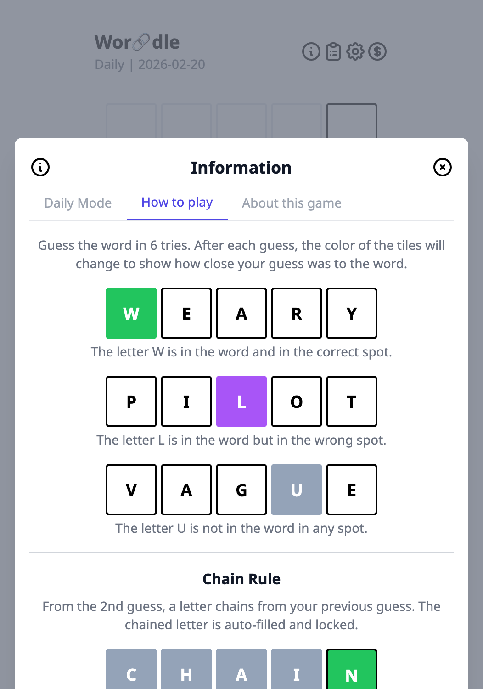
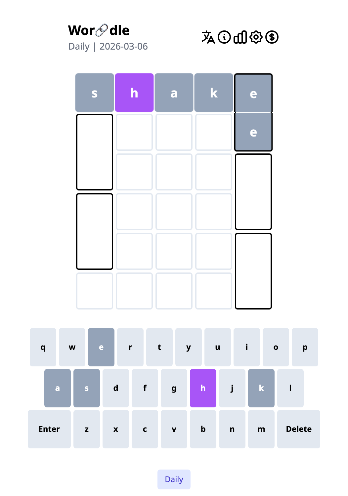
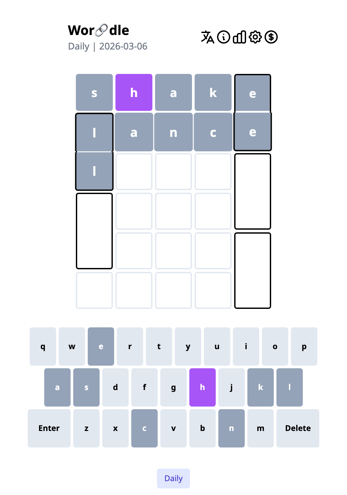
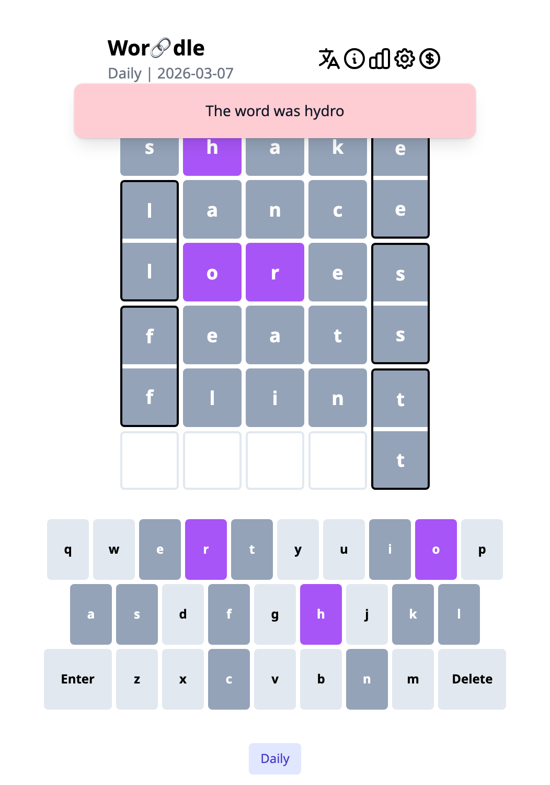
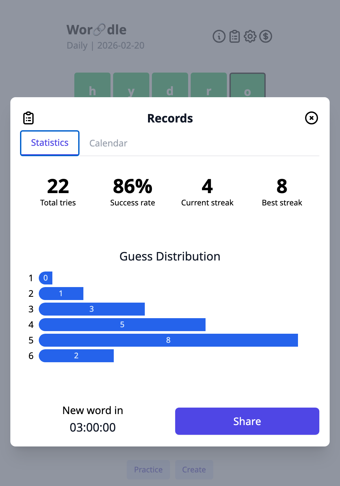

# Wor-chain-dle


**Wordle meets word chain** — guess the word while chaining letters in a snake pattern.

A new word every day at [ootzk.github.io/Wor-chain-dle](https://ootzk.github.io/Wor-chain-dle).

<p align="center">
  
</p>

## How to Play

Guess the hidden 5-letter word in 6 tries. After each guess, tiles change color to show how close you were:

- **Green** — Correct letter, correct spot.
- **Purple** — Correct letter, wrong spot.
- **Gray** — Letter not in the word.

<p align="center">
  
</p>

## The Chain Rule

Here's the twist. Starting from your **2nd guess**, a letter **chains** from your previous word. The chained letter is auto-filled and locked — you can't change it.

Your first guess is free. Let's say you start with **build**:

<p align="center">
  
</p>

Now the last letter **d** chains down to your second guess. It's already locked in — your next word must end (or start) with that letter.

<p align="center">
  
</p>

The chain alternates sides like a snake:

```
Guess 1 → 2:  last letter chains   (right side)
Guess 2 → 3:  first letter chains  (left side)
Guess 3 → 4:  last letter chains   (right side)
Guess 4 → 5:  first letter chains  (left side)
Guess 5 → 6:  last letter chains   (right side)
```

## Dead Ends

&#x26A0;&#xFE0F; Watch out — if the chained letter doesn't match the answer's position, the game ends early. Plan your guesses carefully!

<p align="center">
  
</p>

## Victory

Solve the chain and you'll be rewarded:

<p align="center">
  
</p>

Track your stats and share your results with friends:

<p align="center">
  
</p>

Wor🔗dle 2026/02/16 6/6

─⬜🟪⬜⬜⬜┐  
┌⬜⬜⬜⬜⬜┘  
└⬜🟪🟪⬜⬜┐  
┌⬜⬜⬜⬜⬜┘  
└⬜⬜🟪⬜🟩┐  
─🟩🟩🟩🟩🟩┘  

ootzk.github.io/Wor-chain-dle/

## Development

```bash
npm install
npm start          # dev server (http://localhost:3000)
npm run build      # production build
npm test           # run tests
```

## Credits

- Based on [AnyLanguage-Word-Guessing-Game](https://github.com/roedoejet/AnyLanguage-Word-Guessing-Game)
- Word list from the [original Wordle](https://www.nytimes.com/games/wordle)
- Analytics by [GoatCounter](https://www.goatcounter.com)
