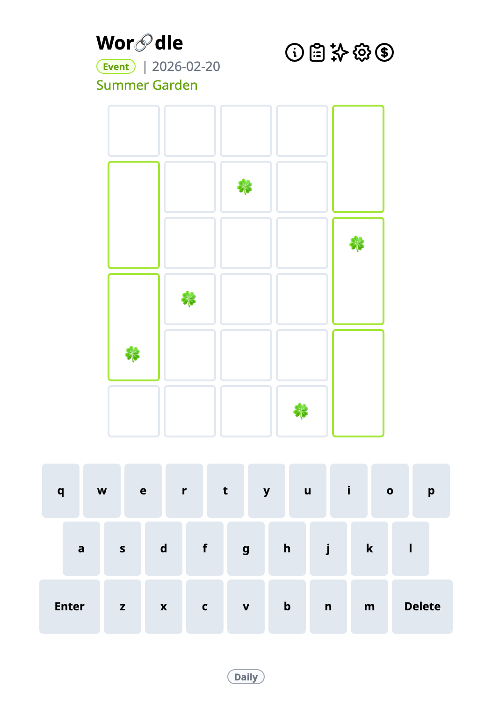
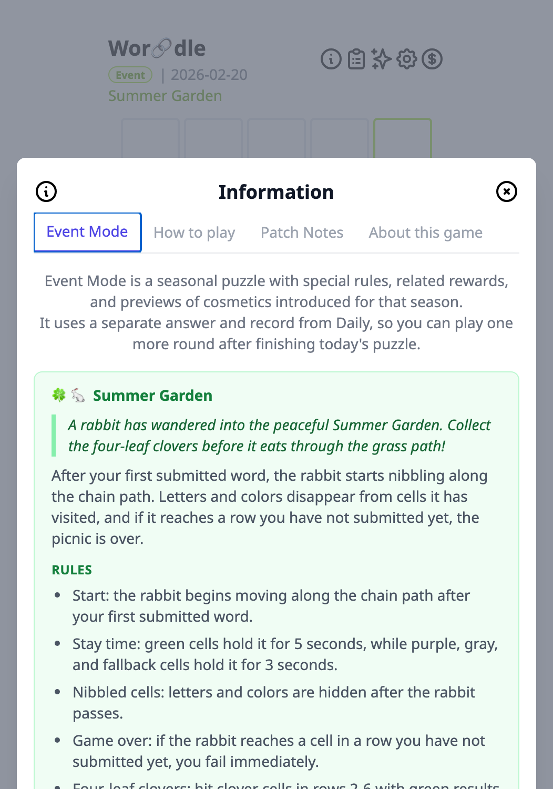
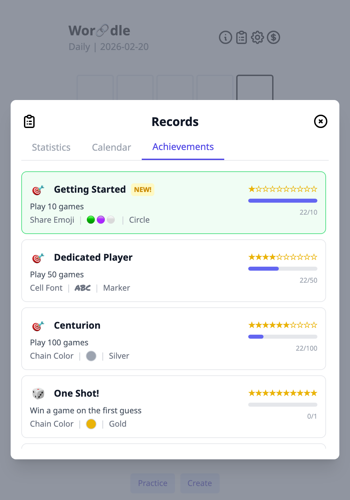
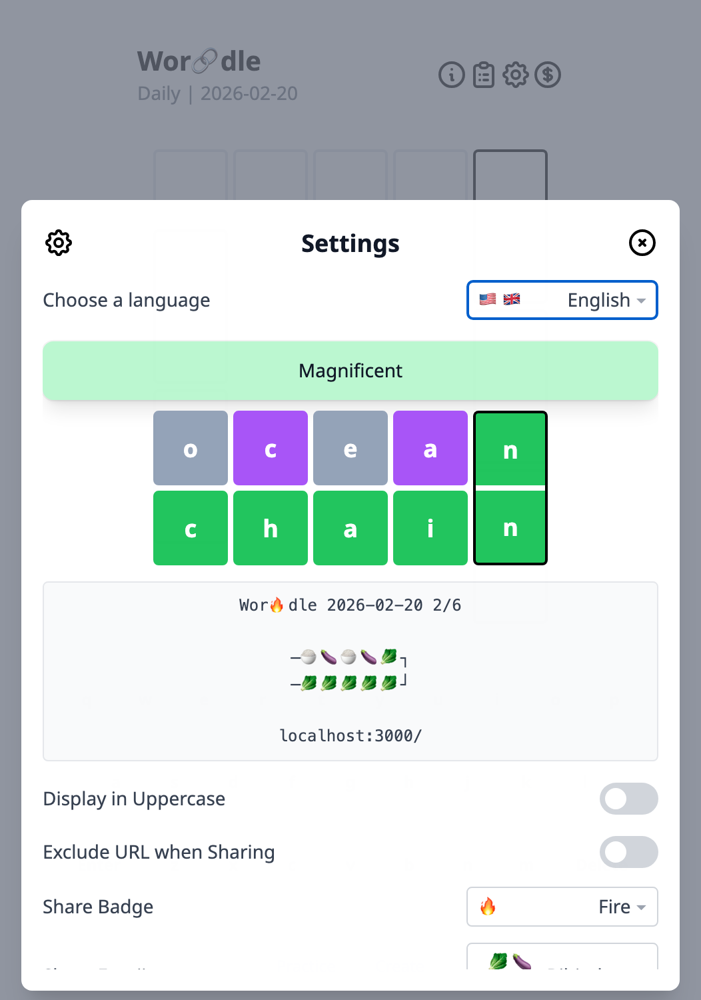
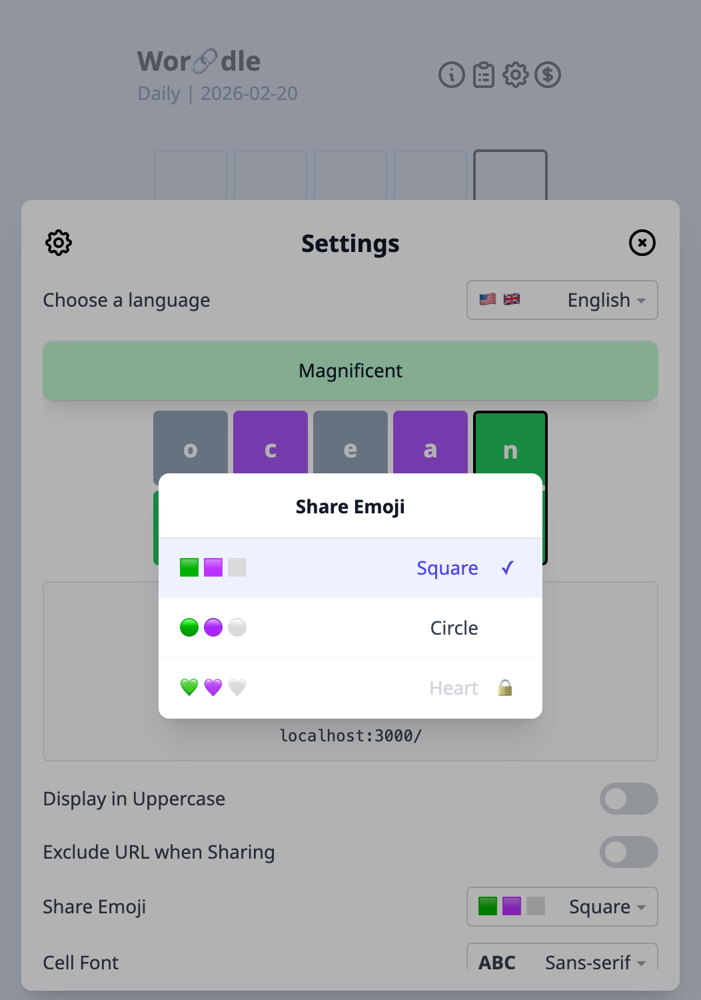
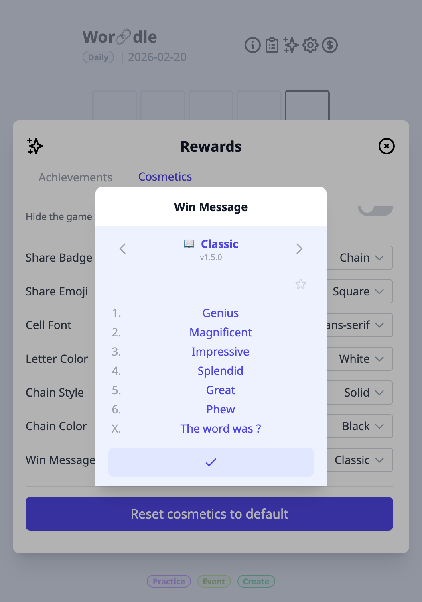
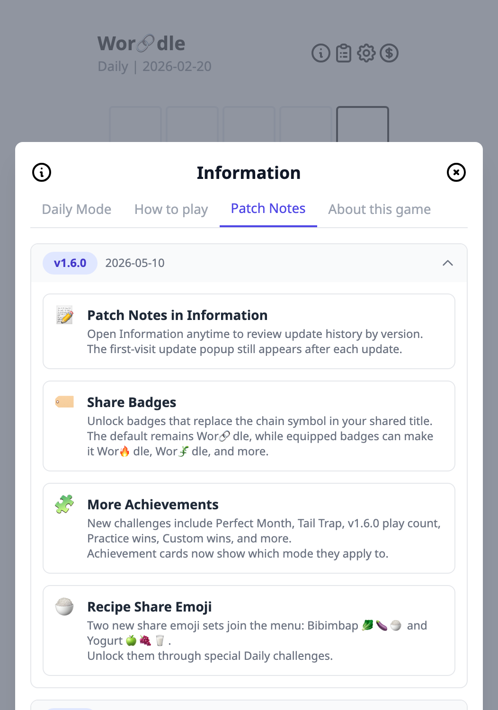

# Wor-chain-dle

[](https://github.com/Ootzk/Wor-chain-dle/releases)

**Wordle meets word chain.** Guess the hidden word while chaining letters through a snake-shaped board.

Play at [ootzk.github.io/Wor-chain-dle](https://ootzk.github.io/Wor-chain-dle).

<p align="center">
  
</p>

---

## How to Play

Guess the hidden 5-letter word in 6 tries. After each guess, tiles change color to show how close you were:

- **Green**: correct letter, correct spot.
- **Purple**: correct letter, wrong spot.
- **Gray**: letter not in the word.

<p align="center">
  
</p>

## The Chain Rule

Starting from your **2nd guess**, a letter chains from your previous word. The chained letter is auto-filled and locked, so your next word has to work around it.

Your first guess is free. If you start with **SHAKE**, the final **E** chains down to the next row:

<p align="center">
  
</p>

Then **LANCE** continues the chain from that locked **E**:

<p align="center">
  
</p>

The chain alternates sides as the board descends:

```text
Guess 1 -> 2: last letter chains
Guess 2 -> 3: first letter chains
Guess 3 -> 4: last letter chains
Guess 4 -> 5: first letter chains
Guess 5 -> 6: last letter chains
```

## Dead Ends

If the chained letter cannot match the answer at that locked position, the game can end early. Plan your guesses carefully.

<p align="center">
  
</p>

## Victory and Sharing

Solve the chain to finish the puzzle, unlock rewards, and share your result.

<p align="center">
  
</p>

<pre>
Wor🔗dle 2026-02-20 6/6

─⬜🟪⬜⬜⬜┐
┌⬜⬜⬜⬜⬜┘
└⬜🟪🟪⬜⬜┐
┌⬜⬜⬜⬜⬜┘
└⬜⬜🟪⬜🟩┐
─🟩🟩🟩🟩🟩┘

ootzk.github.io/Wor-chain-dle
</pre>

---

## Game Modes

Wor-chain-dle has four ways to play:

| Mode         | What it is                                                  | Records          |
| ------------ | ----------------------------------------------------------- | ---------------- |
| **Daily**    | One shared puzzle every day, reset at local midnight.       | Daily records    |
| **Practice** | Unlimited random puzzles after finishing or skipping Daily. | No records       |
| **Event**    | Seasonal puzzles with special rules and related rewards.    | Event records    |
| **Custom**   | Share a puzzle made from your own word.                     | Custom win count |

### Practice Mode

Done with today's word? Practice mode lets you keep playing with random words.

<p align="center">
  
</p>

### Event Mode

Event mode introduces seasonal puzzles with special rules, related rewards, and cosmetics you can preview during that season. Event has a separate answer and record from Daily, so it feels like one more puzzle for the day rather than a replacement.

The current season is **Summer Garden**. A rabbit moves along the chain path after your first guess and hides the cells it has visited. Collect four-leaf clovers before it reaches an unsubmitted row.

Read the full season guide: [Summer Garden](docs/events/summer-garden.md).

<p align="center">
  
  &nbsp;&nbsp;
  
</p>

### Custom Puzzles

Create your own puzzle and challenge your friends. Enter your name and a 5-letter word, copy the link, and your friend can play it with the full chain rule.

<p align="center">
  
  &nbsp;&nbsp;
  
</p>

---

## Records

Daily and Event each keep their own Records view. Today shows your current result, share button, streak, guess count, achievement count, and detailed behavior stats such as timing, submitted actions, failed attempts, deletes, and tile totals.

<p align="center">
  
</p>

The Calendar tab shows your day-by-day history. Daily and Event calendars are tracked separately, so seasonal events can have their own timeline.

<p align="center">
  
</p>

<pre>
Wor🔗dle 2026-03 (🔥 1)

Su Mo Tu We Th Fr Sa
🟩 🟩 🟩 🟩 🟪 🟩 🟩
🟩 🟩 🟪 🟩 ⬜ ⚪ ⚪
⚪ ⚪ ⚪ ⚪ ⚪ ⚪ ⚪
⚪ ⚪ ⚪ ⚪ ⚪ ⚪ ⚪
⚪ ⚪ ⚪

ootzk.github.io/Wor-chain-dle
</pre>

---

## Rewards

Rewards brings Achievements and Cosmetics into one place. Achievements unlock cosmetic items, and filters help you browse by reward type, release, mode, and unlock state.

<p align="center">
  
</p>

Cosmetics let you customize the board and shared results:

- **Share Badge** changes the title symbol in shared results.
- **Share Emoji** changes the emoji set used in share text.
- **Cell Font** changes the letter style on the board.
- **Letter Color** changes tile text color.
- **Chain Style** changes the chain line shape.
- **Chain Color** changes the chain line color.
- **Win Message** changes the result message shown after a game.

The Cosmetics tab includes a live preview and picker popups, so you can compare unlocked options before equipping them.

<p align="center">
  
  &nbsp;&nbsp;
  
</p>

<p align="center">
  
</p>

---

## Profile and Settings

Settings includes language, display, sharing, and gameplay options. You can also export and import your profile to move records, achievements, cosmetics, and preferences between browsers.

- **Profile Management** exports and imports your player profile.
- **Language** switches between 7 bundled languages.
- **Display in Uppercase** changes board and keyboard labels.
- **Exclude URL when Sharing** omits the game URL from share text.
- **Start Calendar Week on Monday** changes Calendar layout.
- **Enable Enter Hints** colors the Enter key when a word can be submitted.
- **Enable Controller** supports controller-style play.

<p align="center">
  
</p>

Wor-chain-dle is available in English, Korean, Japanese, Spanish, Swahili, Chinese, and German.

<p align="center">
  
  &nbsp;&nbsp;
  
</p>

---

## Updates

New releases are introduced through a one-time "What's New" popup. The Information modal also includes a Patch Notes tab where you can browse previous versions by release date.

<p align="center">
  
  &nbsp;&nbsp;
  
</p>

## Support

If you enjoy the game, consider buying the developer a drink.

<p align="center">
  
</p>

---

## Development

```bash
npm install
PUBLIC_URL=/ npm start
PUBLIC_URL=/ npm run build
npm test
```

README screenshots are generated with:

```bash
npm run readme:screenshots
```

Coding agents should read [`AGENTS.md`](AGENTS.md) before making changes. Claude Code also has a compatibility wrapper in [`CLAUDE.md`](CLAUDE.md).

## Credits

- Based on [AnyLanguage-Word-Guessing-Game](https://github.com/roedoejet/AnyLanguage-Word-Guessing-Game)
- Word list from the [original Wordle](https://www.nytimes.com/games/wordle)
- Analytics by [GoatCounter](https://www.goatcounter.com)
